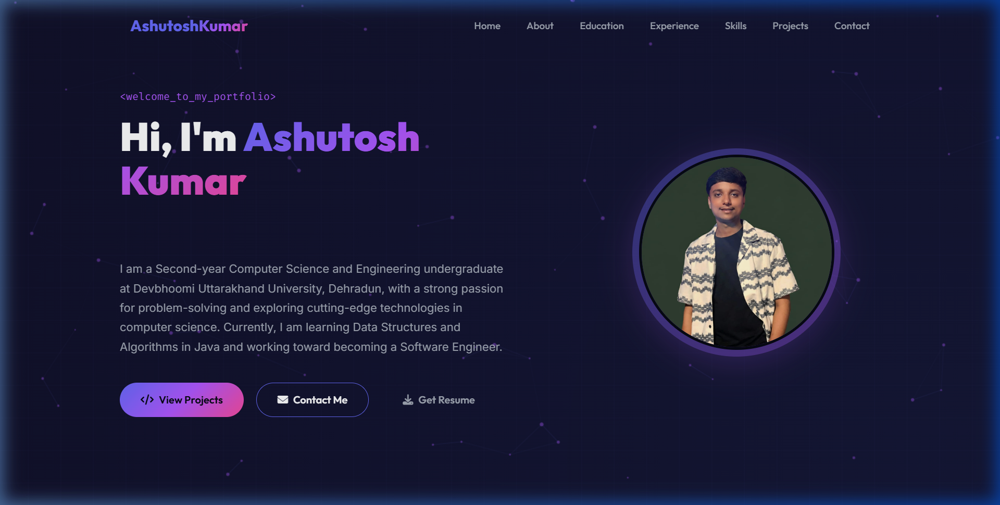
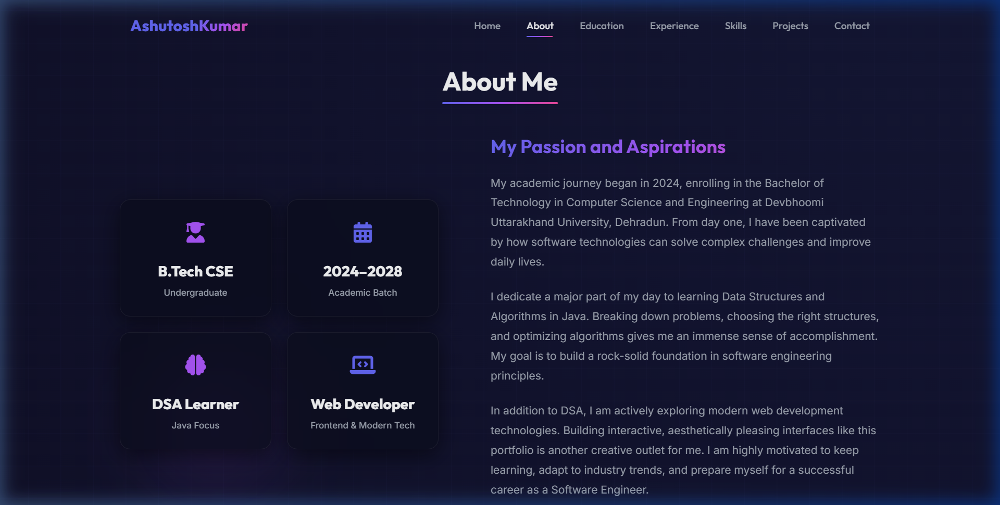
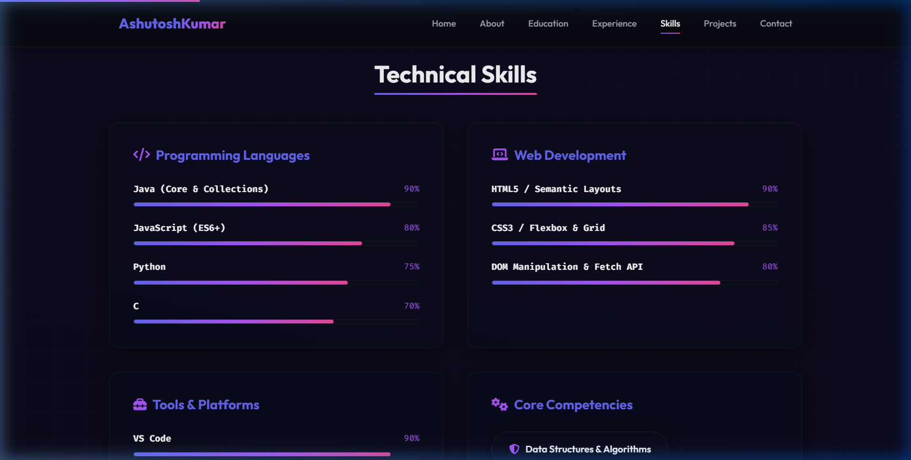
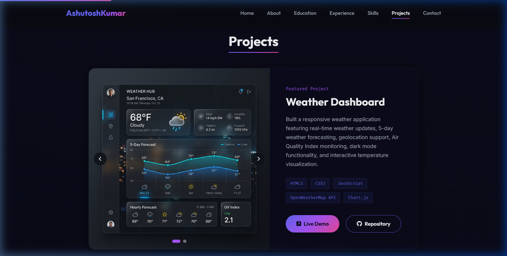
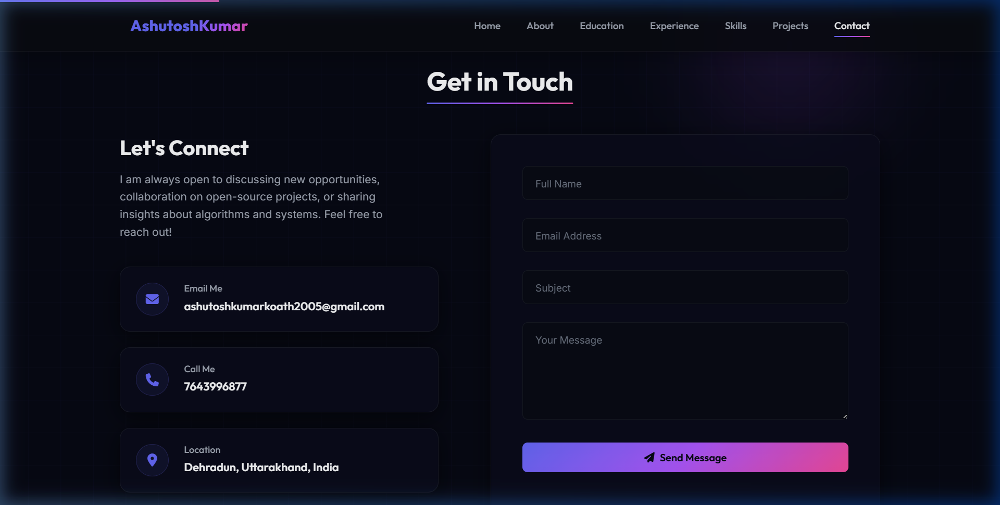

# ⚡ Ashutosh Kumar | Professional Developer Portfolio

A premium, highly interactive, and responsive developer portfolio website designed with glassmorphic aesthetics, fluid micro-animations, and dynamic canvas particle systems. Built from scratch using modern web standards: **semantic HTML5**, **vanilla CSS3**, and **ES6+ JavaScript**.

🔗 **Live Demo:** [Ashutosh Kumar Portfolio](https://github.com/Ashutosh7643) *(or custom deployment link)*

---

## 📷 Screenshots

Here are some visual highlights of the portfolio:

| Hero / Home | About Me |
| :---: | :---: |
|  |  |

| Skills | Projects Showcase |
| :---: | :---: |
|  |  |

| Contact Form |
| :---: |
|  |

---

## 🎨 Visual Design & User Experience

- **Interactive Canvas Particle System:** The hero section features a custom, high-performance HTML5 canvas particle system that responds to page scrolling.
- **Glassmorphism Theme:** Custom-curated HSL colors, dark modes, blur backdrops, and glowing gradients create a state-of-the-art visual style.
- **Scroll-Triggered Reveals:** Smooth fade-and-slide animation triggers as you scroll down the page, enhancing content discovery.
- **Fully Responsive & Accessible:** Fully optimized for mobile, tablet, and desktop views with semantic layouts, ARIA labels, and custom focus indicators.
- **Project Showcase Carousel:** Features interactive screenshots and detailed technical stacks using a custom JavaScript-based media slider.
- **EmailJS Integration:** Features a fully functional contact form that validates user inputs and sends email inquiries directly without needing a backend.

---

## 🛠️ Tech Stack & Dependencies

- **Core Structure:** Semantic HTML5, responsive CSS3 (Flexbox & CSS Grid), Vanilla ES6+ JavaScript.
- **Iconography:** FontAwesome v6.4.0 (loaded via CDN).
- **Communication:** EmailJS SDK for direct browser-based email delivery.
- **Typography:** Google Fonts (Outfit, Inter, Space Mono).

---

## 📂 Project Structure

```bash
Portfolio/
├── assets/                    # Image assets (mockups, profile picture, screenshots)
│   ├── ashutosh_profile.jpg   # Main profile photograph
│   ├── amul_kool_mockup.png   # Amul Kool project mockup
│   ├── gully_rasoi_mockup.png # Gully Rasoi project mockup
│   ├── spotify_clone_mockup.png # Spotify Clone project mockup
│   ├── weather_dashboard_mockup.png # Weather Dashboard project mockup
│   └── screenshots/           # UI screenshots of different sections
│       ├── hero.png           # Hero/Home section screenshot
│       ├── about.png          # About Me section screenshot
│       ├── skills.png         # Skills section screenshot
│       ├── projects.png       # Projects Showcase section screenshot
│       └── contact.png        # Contact Form section screenshot
├── index.html                 # Main structure and content markup
├── style.css                  # Custom styling (CSS variables, layouts, animations)
├── script.js                  # Frontend functionality and interactive logic
├── .gitignore                 # Excluded directories (e.g. IDE folders)
└── README.md                  # Project documentation (this file)
```

---

## 🚀 Key Content Sections

### 1. Home / Hero
Introduces Ashutosh Kumar with a dynamic typing animation ("Java Developer", "DSA Enthusiast", "Software Engineer") and key CTA buttons (View Projects, Contact, and Download Resume).

### 2. About Me
A summary of academic focus, problem-solving passion, and interactive statistic cards displaying key qualifications.

### 3. Education Timeline
Documents educational milestones (B.Tech at Devbhoomi Uttarakhand University, Senior Secondary & Secondary education).

### 4. Professional Experience
Highlights roles such as **Web Development Intern at Pinnacle Lab**, emphasizing skills gained in frontend design and development workflows.

### 5. Technical Skills
Categorized, animated progress bars detailing competence in:
- **Languages:** Java (Core & Collections), JavaScript (ES6+), Python, C.
- **Web Development:** HTML5, CSS3, DOM Manipulation, Fetch API.
- **Tools:** VS Code, Git/GitHub, LeetCode.

### 6. Projects Showcase
- **Weather Dashboard:** Real-time forecasting and metrics visualization using OpenWeatherMap API and Chart.js.
- **Amul Kool Animated Website:** Visually stunning animated landing page incorporating GSAP and ScrollTrigger.
- **Gully Rasoi Restaurant:** Premium, cinematic dining site with canvas-rendered ember systems and reservation panels.

### 7. Contact Form & Footer
A customized form with micro-feedback styling connected to EmailJS, alongside links to LinkedIn, GitHub, and LeetCode.

---

## ⚙️ Getting Started

### 1. Run Locally
To run this project on your local machine:
1. Clone the repository:
   ```bash
   git clone https://github.com/Ashutosh7643/Ashutosh-Portfolio.git
   ```
2. Navigate into the directory and open `index.html` in your browser.
3. Alternatively, if using VS Code, install the **Live Server** extension, right-click `index.html`, and select **Open with Live Server**.

### 2. Set Up Contact Form (EmailJS)
To enable the contact form to deliver messages to your email inbox:
1. Register for a free account at [EmailJS](https://www.emailjs.com/).
2. Add an email service (e.g., Gmail) and create an email template.
3. Replace the Initialization key on line 706 of `index.html`:
   ```javascript
   emailjs.init("YOUR_PUBLIC_KEY");
   ```
4. Update the template and service IDs in `script.js` to match your EmailJS dashboard settings:
   ```javascript
   emailjs.send("YOUR_SERVICE_ID", "YOUR_TEMPLATE_ID", templateParams)
   ```

---

## 📄 License
This project is open-source and available under the MIT License. Feel free to customize and use it for your own developer profile!
